# Change log

## Beginning - Static Website

In June 2017, my friend show me his website and after I sew, I realized that I want have the own website. So I copied his website, and rebuild for myself:

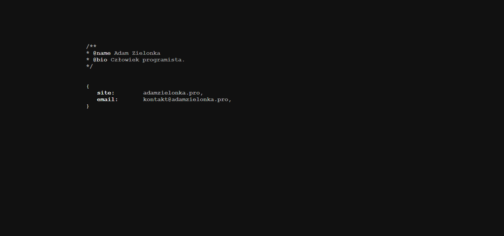

But creating the same website like friend isn't fair to the friend, so I rewrite again. My idea was to create website that looks like terminal.

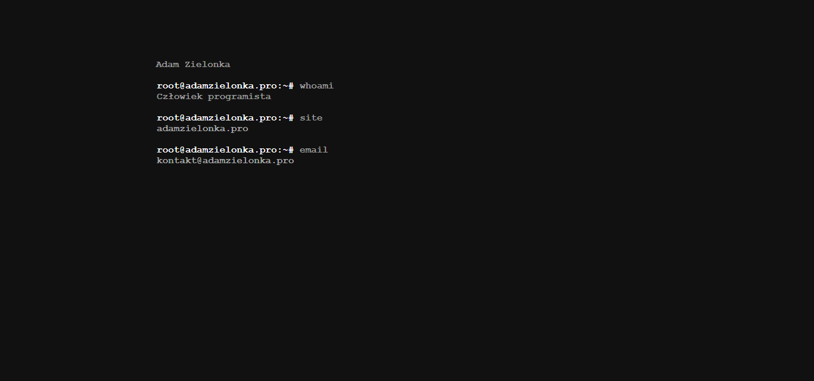
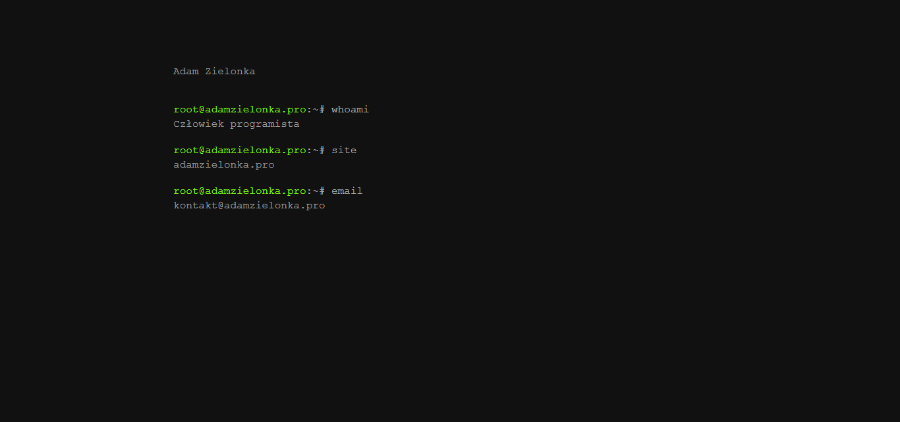
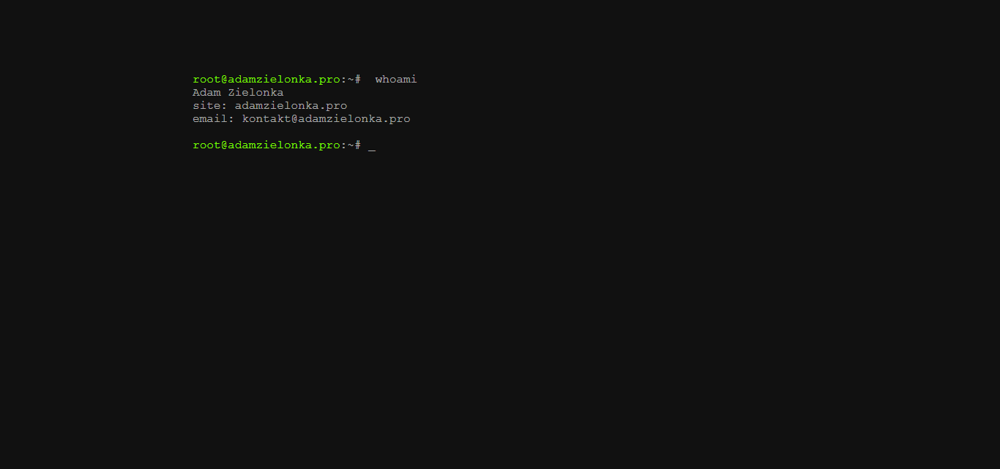
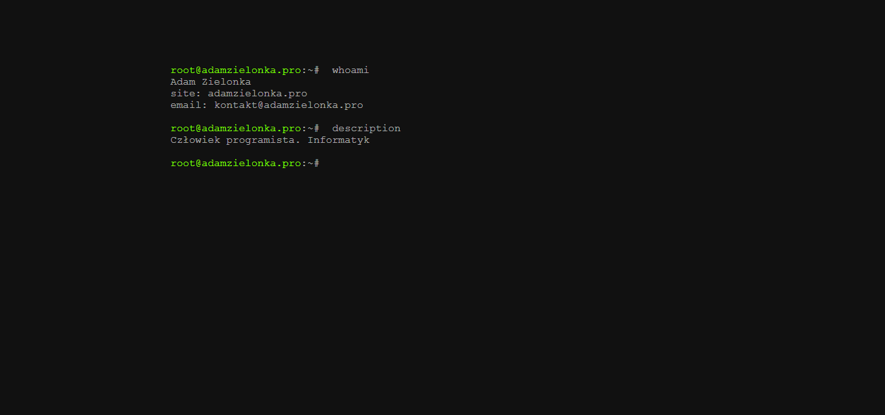
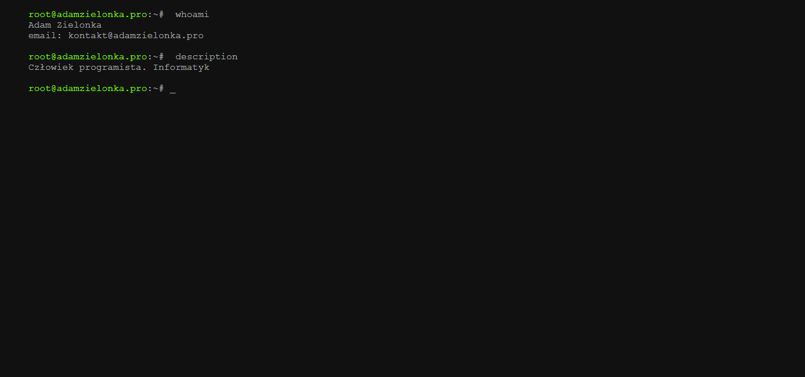

Website was very empty, no project that can promote me, so in October 2017, I add my first projects:

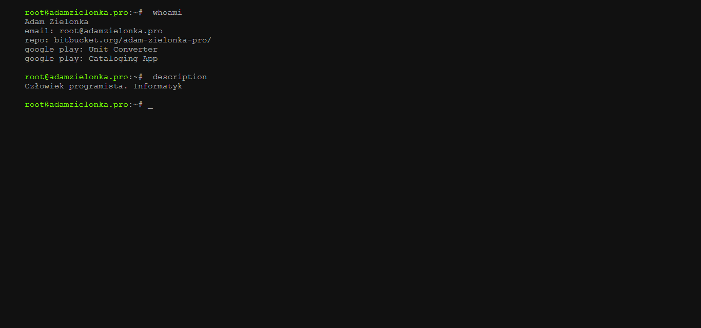

Website wasn't presenting information, so on beginning of 2018 I rebuild the whoami layout.

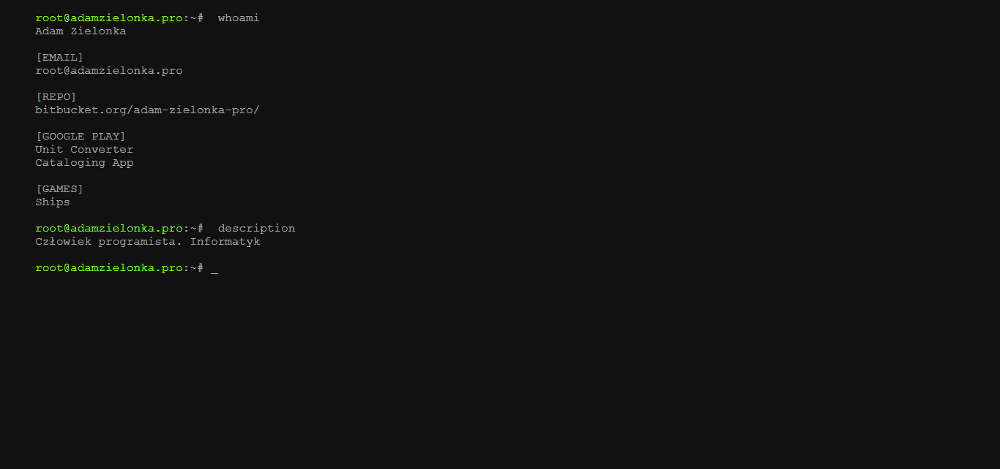
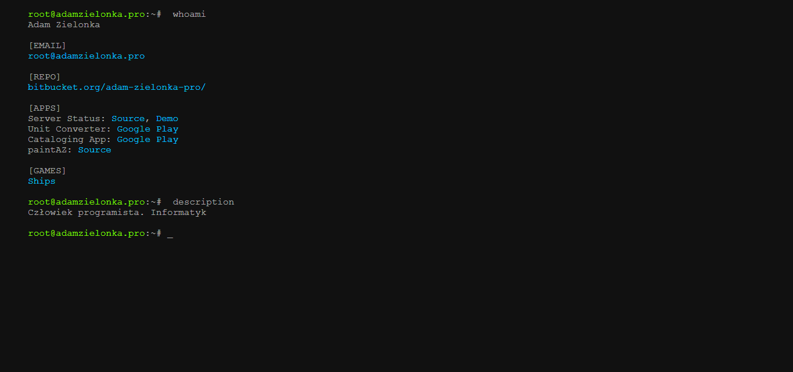

When autumn 2018 came, I did last correction.

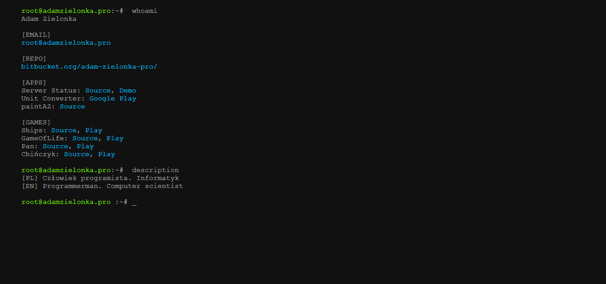

## React - Interaction Website

In March 2019, I decided to move website React.js and I did it. Static website was put in noscript section. Yea. But it wasn't very good code to edit, so page look very similar to the static website. One different was animation, but it think it is possible to get the same effect using css.

In August 2019, I had the breakdown. I rewrite the terminal code, that me allow to add interaction. I also rewrite the animation form no-script version of website, so no differences between static and react version.

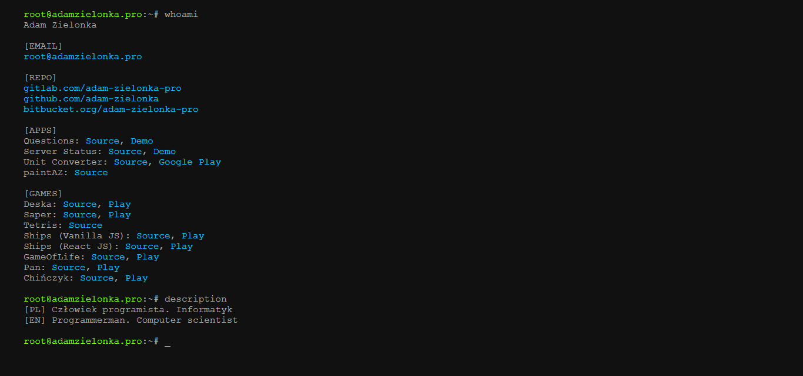

## Svelte

In December 2021, My friend told me that Svelte is something nicer to use, so here we are, and the new version of this website is base on Svelte. I need to admit that styles, html and scripts in one file look attractive for me. And it works pretty well for me. But stores, needs from me some efforts to understand similar but different approach like in Mobx, but in the end in three days I rewrote app to new technology.

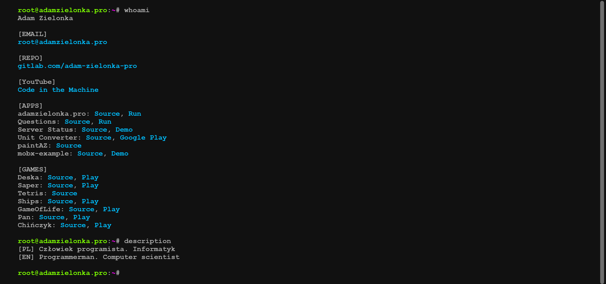
